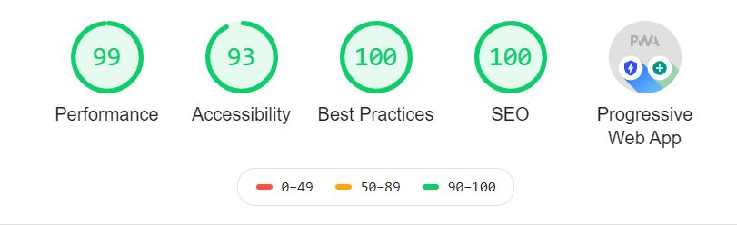

<div align="center"  style="margin-bottom:30px">
    
</div>

<div align="center">
	<a href='https://github.com/mishal23/gatsby-starter-fresh/blob/master/LICENSE'>
    
    </a>
    <a href='https://www.codacy.com?utm_source=github.com&amp;utm_medium=referral&amp;utm_content=mishal23/gatsby-starter-fresh&amp;utm_campaign=Badge_Grade'>
      
    </a>
    <a href='https://app.netlify.com/sites/gatsby-starter-fresh/deploys'>
      
    </a>
</div>

# Gatsby Starter Fresh

A starter blog skeleton using the Fresh Theme for [Gatsby](https://github.com/gatsbyjs/gatsby/). The starter is created from my own [personal website](https://mishal23.github.io/) originally inspired from the [Fresh theme](https://github.com/artemsheludko/fresh). The project aims to provide minimal base for building a user-friendly and fast blogging site for anyone.

## Features

- Built with GatsbyJS
- Blazing fast loading time
- Mobile Friendly
- High quality code (A)
- Component seperated code
- Custom 404 page
- In-built contact form powered by Formspree
- Markdown support for new posts
- Code syntax highlighting
- [Disqus](https://disqus.com/) support for comments
- Supports PWA
- Social Media icons
- SEO friendly
	- option to add meta description
	- Sitemap Generation
	- Twitter tags (Twitter cards)
- Google Analytics

## 🚀 Quick start

- Install this starter locally (assuming you have GatsbyJS installed)

```bash
gatsby new gatsby-starter-fresh https://github.com/mishal23/gatsby-starter-fresh
```

- Start developing by navigating in your site directory and start it up

```bash
cd gatsby-starter-fresh/
gatsby develop
```

The site would be running live on ```http://localhost:8000```. Open the `gatsby-starter-fresh` directory in a code editor of your choice and edit `gatsby-config.js` with your details:

- Name
- Description
- Keywords
- Social media usernames (twitter, facebook, github, email, linkedin, formspree)
- Disqus `shortname` at `gatsby-plugin-disqus` plugin
- `trackingID` at `gatsby-plugin-google-analytics` plugin

Feel free to create new posts in the `src/posts` directory. The changes will be reflected in real-time on your browser.

## Lighthouse Audit Score



## Contributing

- Incase you wish to add any features, please fork the project, make the changes and send a Pull Request.

```bash
git clone https://github.com/<your username>/gatsby-starter-fresh
cd gatsby-starter-fresh
npm install
gatsby develop
```
- You can also write by opening an [issue](https://github.com/mishal23/gatsby-starter-fresh/issues) on the repository, incase of any issues.

## Author

- Mishal Shah ([@mishal23](https://github.com/mishal23))
